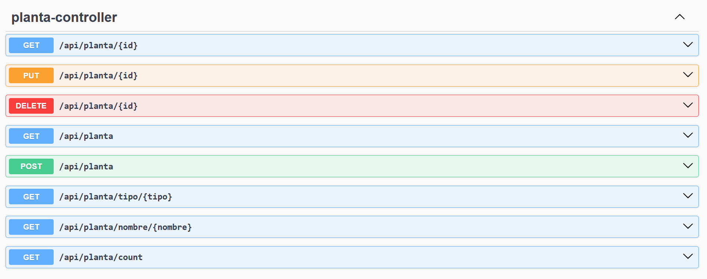
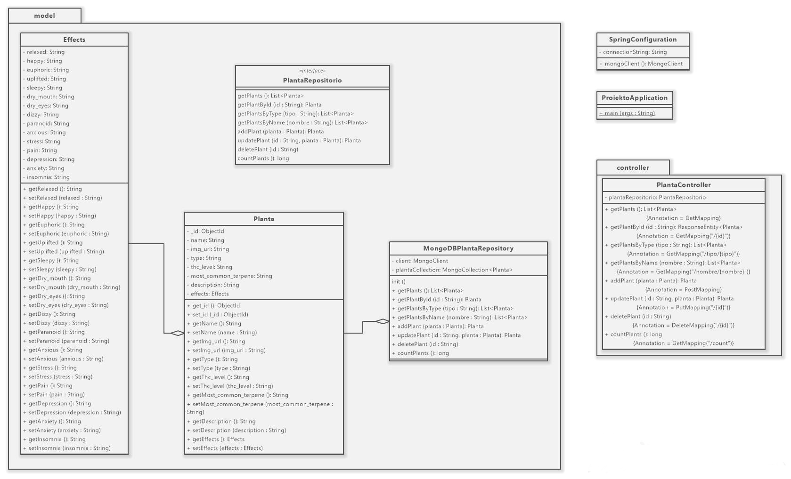

# PROIEKTU PERTSONALA
Proiektuak REST API bat eskaintzea du helburu, Spring Java teknologia erabiliz MongoDB datu-base batean gordetako datuak eskuratzeko. 

## Datu iturria
Mongo datu-baseko dokumentuak (500 baino gehiago) kanpo iturriren batetik hartutakoak izango dira eta sakontasun maila bat eduki beharko dute gutxienez. Hau da, derrigorrez eremuetako bat arraya edo json objektua izango da. Zenbat eta datu mota gehiago, zenbat eta dokumentuen sakontasuna handiagoa, hobe, beti ere informazioa zentzuzkoa, interesgarria eta esanguratsua bada. 

Hori kontuan hartuta, Kaggle plataformatik [dataset](leafly_strain_data.json) hau hartu dut.

## Rest zerbitzua
Hau da restapiaren itxura:

Hor sartzeko, http://localhost:8080/swagger-ui/index.html linka erabili behar da proiektua martxan dagoen bitartean (Spring web).

Endpointen taula (Mota, EndPointa eta Emaitza zutabeekin)
| Mota  |  EndPointa  | Emaitza |
|:------------- |:---------------| :-------------|
| GET         | /api/planta/{id}     | Landare bat bueltatzen du id arabera             |
| PUT         | /api/planta/{id}      | Landare bat eguneratzen du id arabera             |
| DELETE         | /api/planta/{id}      | Landare bat ezabatzen du id arabera       |
| GET         | /api/planta        |  Landare guztiak bueltatzen ditu  |
| POST         | /api/planta        | Landare berri bat sortzen du        |
| GET         | /api/planta/tipo/{tipo}  | Landareak bueltatzen ditu motaren arabera        |
| GET         | /api/planta/nombre/{nombre}      |  Landareak bueltatzen ditu izenaren arabera        |     |
| GET         | /api/planta/count      |  Landareen zenbatekoa bueltatzen du     |

## Mongo datubasea
Datu Baseko izena plantas da, kolekzioaren izena planta.
Mongo datubasea erabiltzeko mongo eta Compass instalatu behar ditugu. Behin Compass instalatuta, Connection String sartzeko eskatuko digu, eta hurrengoa erabiliko dugu: mongodb://localhost (Mongo-ren default portua: 27017) Ondoren, datu-basea sor dezakegu ezkerreko aldean eta barruan bilduma batekin. Bilduma horretara importatu dezakegu CSV edo JSONa datuak datubasera gehitzeko.

## Java proiektua

Argazkian ikusi daiteke proiektuaren klase diagrama. 

Model: Effects, Planta eta MongoDBPlantaRepositorio eta PlantaRepositorio klaseak daude. Effects eta Planta klaseetan konstruktoreak, getter eta setterak daude. Repositorio klaseetan datuak bildu eta kudeatzen dira ondoren operazioak egiteko.

Controller: PlantaController klasea dago. 
Klase hau da kontroladorea, non zerbitzuaren eskaerak aurrera eramaten dira.

SpringConfiguration eta ProiektoApplication kanpoan daude. Hauek proiektuaren konfigurazioa eta hastea eramaten dute.
